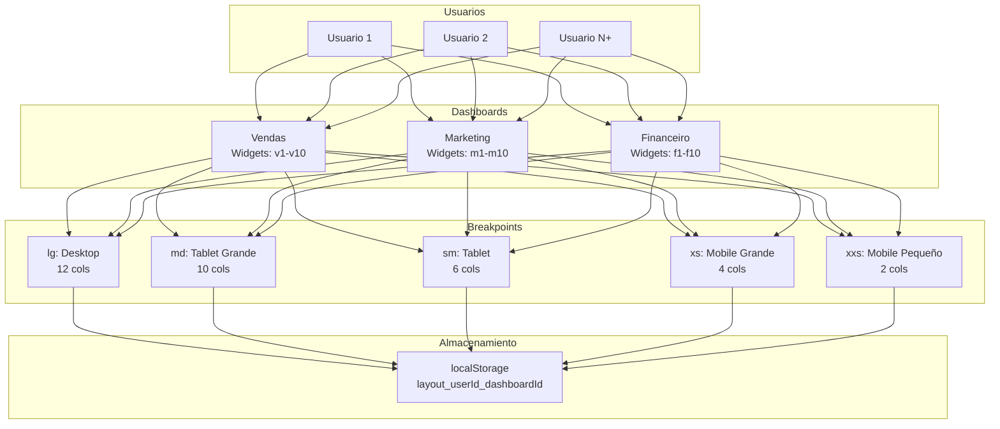

# Plan de Modificaciones del Dashboard Widget Prototype

## Análisis del Código Existente

### Arquitectura Actual

El proyecto sigue una arquitectura en capas con separación de responsabilidades:

```
src/
├── domain/              # Entidades de dominio
├── application/         # Casos de uso y estado global
├── infrastructure/      # Configuración y datos mock
└── presentation/        # Componentes UI
```

### Componentes Principales

1. **AuthContext**: Gestiona autenticación de usuarios
2. **LayoutContext**: Gestiona layouts de dashboards por usuario y breakpoint
3. **DashboardPage**: Página principal con grid responsive
4. **Sidebar**: Navegación entre dashboards
5. **WidgetPicker**: Modal para agregar widgets
6. **WidgetRegistry**: Registro de componentes de widgets

### Dashboards Actuales

1. **Vendas**: Widgets [w1, w2, w5, w6, w8, w9]
2. **Marketing**: Widgets [w3, w4, w7, w10]
3. **Financeiro**: Widgets [w1, w2, w5, w6, w7, w8, w9, w10]

---

## Problemas Identificados

### 1. CRÍTICO: Widgets Compartidos Entre Dashboards

**Problema**: Los widgets w1, w2, w5, w6, w7, w8, w9 están compartidos entre múltiples dashboards, violando el requisito de que cada dashboard debe tener widgets exclusivos.

**Impacto**: 
- Un usuario puede agregar un widget de Vendas en el dashboard Marketing
- No hay separación clara de dominios
- Confusión en la UX

**Solución**: Crear widgets específicos para cada dashboard.

### 2. Layouts Responsive con Espacios Vacíos

**Problema**: En resoluciones mobile (xs, xxs), los layouts pueden dejar espacios vacíos si los widgets no ocupan el ancho completo.

**Impacto**: 
- UX pobre en dispositivos móviles
- Diseño no profesional

**Solución**: Revisar y optimizar layouts para cada breakpoint.

### 3. WidgetPicker Muestra Todos los Widgets

**Problema**: El WidgetPicker muestra todos los widgets disponibles, sin filtrar por dashboard actual.

**Impacto**: 
- Usuario puede agregar widgets incorrectos
- Violación de la lógica de dominio

**Solución**: Filtrar widgets por dashboard actual.

### 4. Falta de Validaciones

**Problema**: No hay validaciones robustas para:
- Datos de localStorage corruptos
- Layouts inválidos
- IDs de widgets inexistentes

**Impacto**: 
- Posibles errores en runtime
- Experiencia de usuario inconsistente

**Solución**: Agregar validaciones y manejo de errores.

### 5. Rendimiento

**Problema**: 
- Guardado automático en cada cambio (sin debounce)
- Falta de memoización en componentes
- Re-renders innecesarios

**Impacto**: 
- Performance degradado con muchos widgets
- Experiencia no fluida

**Solución**: Optimizar con debounce y memoización.

### 6. UX Mejorable

**Problema**: 
- No hay indicadores visuales claros de cambios
- Toast de breakpoint aparece repetidamente
- No hay estados de carga

**Impacto**: 
- Confusión del usuario
- Experiencia no profesional

**Solución**: Mejorar feedback visual y UX.

---

## Plan de Soluciones

### Fase 1: Estructura de Datos

#### 1.1 Crear Widgets Específicos por Dashboard

**Archivo**: `src/infrastructure/mock/mock.ts`

**Cambios**:
- Crear widgets específicos para Vendas: `v1-v10`
- Crear widgets específicos para Marketing: `m1-m10`
- Crear widgets específicos para Financeiro: `f1-f10`
- Actualizar `widgetCatalog` para incluir propiedad `dashboardId`
- Crear datos mock para cada widget

**Ejemplo**:
```typescript
export const widgetCatalog = [
  // Vendas
  { id: "v1", name: "Vendas Totais", type: "kpi", dashboardId: "dashboard-vendas" },
  { id: "v2", name: "Receita do Mês", type: "kpi", dashboardId: "dashboard-vendas" },
  // Marketing
  { id: "m1", name: "Leads Gerados", type: "kpi", dashboardId: "dashboard-marketing" },
  { id: "m2", name: "Taxa de Conversão", type: "kpi", dashboardId: "dashboard-marketing" },
  // Financeiro
  { id: "f1", name: "Fluxo de Caixa", type: "kpi", dashboardId: "dashboard-financeiro" },
  { id: "f2", name: "Despesas do Mês", type: "kpi", dashboardId: "dashboard-financeiro" },
  // ... más widgets
]
```

#### 1.2 Actualizar Entidades de Dominio

**Archivo**: `src/domain/entities/index.ts`

**Cambios**:
- Agregar propiedad `dashboardId` a `WidgetCatalogItem`
- Crear tipos específicos para datos de widgets

**Ejemplo**:
```typescript
export interface WidgetCatalogItem {
  id: string;
  name: string;
  type: WidgetType;
  dashboardId: string; // Nuevo campo
}
```

### Fase 2: Configuración de Dashboards

#### 2.1 Actualizar DashboardConfigs

**Archivo**: `src/infrastructure/config/dashboardConfigs.ts`

**Cambios**:
- Actualizar `defaultWidgets` con los nuevos IDs de widgets
- Revisar layouts para cada breakpoint
- Asegurar que no haya espacios vacíos en mobile

**Layouts Optimizados**:
- **lg (12 cols)**: Layout completo para desktop
- **md (10 cols)**: 2 columnas para tablets grandes
- **sm (6 cols)**: 2 columnas para tablets
- **xs (4 cols)**: 1 columna (ancho completo)
- **xxs (2 cols)**: 1 columna (ancho completo)

### Fase 3: Lógica de Layout

#### 3.1 Actualizar LayoutContext

**Archivo**: `src/application/store/LayoutContext.tsx`

**Cambios**:
- Agregar validaciones al cargar layouts de localStorage
- Manejar layouts corruptos con fallback a defaults
- Optimizar efectos para evitar re-renders

#### 3.2 Actualizar DashboardPage

**Archivo**: `src/presentation/pages/DashboardPage.tsx`

**Cambios**:
- Filtrar `widgetCatalog` por dashboard actual
- Filtrar `availableWidgets` por dashboard actual
- Agregar debounce al guardado automático
- Mejorar indicadores visuales

**Filtrado por Dashboard**:
```typescript
const dashboardWidgets = widgetCatalog.filter(w => 
  w.dashboardId === layoutState.currentDashboardId
);
const activeCatalog = dashboardWidgets.filter(w => 
  currentDashboard.activeWidgets.includes(w.id)
);
const availableWidgets = dashboardWidgets.filter(w => 
  !currentDashboard.activeWidgets.includes(w.id)
);
```

### Fase 4: Componentes UI

#### 4.1 Actualizar WidgetPicker

**Archivo**: `src/presentation/components/WidgetPicker.tsx`

**Cambios**:
- Ya recibe `availableWidgets` filtrados (no hay cambios necesarios)
- Mejorar UX con categorización por tipo

#### 4.2 Mejorar Sidebar

**Archivo**: `src/presentation/components/Sidebar.tsx`

**Cambios**:
- Mostrar contador de widgets activos por dashboard
- Indicador visual de dashboard con cambios sin guardar

### Fase 5: Optimización y UX

#### 5.1 Agregar Debounce al Guardado

**Archivo**: `src/application/store/LayoutContext.tsx`

**Implementación**:
```typescript
useEffect(() => {
  const timeoutId = setTimeout(() => {
    if (state.userId) {
      const currentDashboard = state.dashboards[state.currentDashboardId];
      if (currentDashboard) {
        saveUserLayout(
          state.userId,
          state.currentDashboardId,
          currentDashboard.activeWidgets,
          currentDashboard.layouts
        );
      }
    }
  }, 1000); // 1 segundo de debounce

  return () => clearTimeout(timeoutId);
}, [state.userId, state.currentDashboardId, state.dashboards]);
```

#### 5.2 Mejorar Toast de Breakpoint

**Archivo**: `src/presentation/pages/DashboardPage.tsx`

**Cambios**:
- Mostrar toast solo una vez por breakpoint
- Usar localStorage para recordar si ya se mostró

#### 5.3 Agregar Indicadores Visuales

**Cambios**:
- Indicador de "guardando..." cuando hay cambios
- Indicador de "guardado" cuando se completó
- Animaciones suaves de transición

### Fase 6: Validaciones

#### 6.1 Validar Layouts al Cargar

**Archivo**: `src/application/useCases/getUserLayout.ts`

**Cambios**:
- Validar estructura de datos
- Validar que los widgets existan en el catálogo
- Validar que los layouts tengan el formato correcto

**Ejemplo**:
```typescript
function validateLayout(layout: any): boolean {
  if (!layout || typeof layout !== 'object') return false;
  if (!Array.isArray(layout.activeWidgets)) return false;
  if (typeof layout.layouts !== 'object') return false;
  
  // Validar cada breakpoint
  for (const [breakpoint, items] of Object.entries(layout.layouts)) {
    if (!Array.isArray(items)) return false;
    for (const item of items) {
      if (!item.i || typeof item.x !== 'number' || typeof item.y !== 'number') {
        return false;
      }
    }
  }
  
  return true;
}
```

---

## Diagrama de Arquitectura Propuesta



---

## Orden de Implementación

1. ✅ Analizar y comprender el código existente
2. 🔄 Identificar problemas y áreas de mejora
3. ⏳ Definir nueva estructura de datos para widgets específicos por dashboard
4. ⏳ Modificar mock.ts para separar widgets por dashboard
5. ⏳ Actualizar dashboardConfigs.ts con widgets específicos exclusivos
6. ⏳ Modificar LayoutContext.tsx para manejar widgets por dashboard
7. ⏳ Actualizar DashboardPage.tsx para filtrar widgets por dashboard actual
8. ⏳ Mejorar layouts responsive para evitar espacios en mobile
9. ⏳ Optimizar WidgetPicker para mostrar solo widgets del dashboard actual
10. ⏳ Agregar validaciones y manejo de errores robusto
11. ⏳ Mejorar UX con indicadores visuales y feedback
12. ⏳ Optimizar rendimiento con memoización y debounce
13. ⏳ Probar funcionalidad completa del sistema

---

## Consideraciones de Escalabilidad

### Para 100+ Usuarios

1. **LocalStorage**: Funciona bien para prototipos, pero para producción:
   - Considerar backend con base de datos
   - Implementar paginación de layouts
   - Usar compresión para datos grandes

2. **Performance**:
   - Lazy loading de widgets
   - Virtual scrolling para listas largas
   - Code splitting por dashboard

3. **Arquitectura**:
   - Mantener separación clara de responsabilidades
   - Usar TypeScript para type safety
   - Implementar tests unitarios y de integración

---

## Métricas de Éxito

1. ✅ Cada dashboard tiene widgets exclusivos
2. ✅ Layouts responsive sin espacios vacíos
3. ✅ WidgetPicker muestra solo widgets del dashboard actual
4. ✅ Validaciones robustas previenen errores
5. ✅ UX fluida con feedback visual
6. ✅ Performance optimizado con debounce y memoización
7. ✅ Sistema escalable para 100+ usuarios

---

## Próximos Pasos

Una vez aprobado este plan, procederemos a:

1. Implementar los cambios en el orden especificado
2. Probar cada cambio individualmente
3. Realizar pruebas de integración
4. Validar UX en diferentes dispositivos
5. Documentar cambios y decisiones